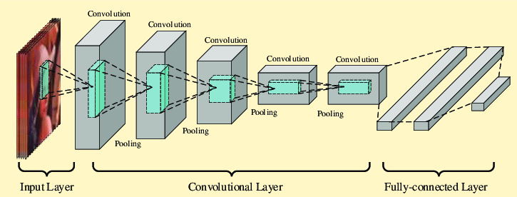

# Convolutional Neural Network

To create a CNN we need to understand what is a `Convolutional` and `Pooling` layers. On [this page](https://poloclub.github.io/cnn-explainer) you can explore how CNN works from inside. In this part of my study of AI and NN, I will explain only how to create a binary CNN which can only recognize two types of something (e.g. pizza or steak). It is believed that it is better to use `Transfer Learning` for multiclass clasification (We will learn how Transfer Learning works in the next section).

### Types of Pooling layer:

- Max Pool
- Min Pool
- Average Pool

## Get our data ready

The first part before creating a CNN model we need to prepare our images. To get our data ready for fitting to our model I will use `ImageDataGenerator` from `tensorflow.keras.preprocessing.image` module. This class has a lot of benefits such as splitting our data into batches and augmenting it: scale, shifting, rotation etc. It also process our images on-the-fly so it does not change source files. You can read more about this class on the [following page](https://www.tensorflow.org/api_docs/python/tf/keras/preprocessing/image/ImageDataGenerator).

Here is an example how to create an instance of the class to process our data later:

```python
IMG_SIZE = (224, 224)

train_datagen_augmented = ImageDataGenerator(
  rescale=1/255.,
  rotation_range=0.2,
  shear_range=0.2,
  zoom_range=0.2,
  width_shift_range=0.2,
  height_shift_range=0.2,
  horizontal_flip=True
)

test_datagen = ImageDataGenerator(
  rescale=1/255.
)

train_data_augmented = train_datagen_augmented.flow_from_directory(
  directory="pizza_steak/train",
  target_size=IMG_SIZE,
  class_mode="binary",
)

test_data = test_datagen.flow_from_directory(
  directory="pizza_steak/test",
  target_size=IMG_SIZE,
  class_mode="binary",
)
```

Method `flow_from_directory` returns a [python generator](https://wiki.python.org/moin/Generators) to let our model get our data split into chunks while fitting it.

## CNN model

Here is an example what we are going to create with `tensorflow`:



So let's create something like this using `keras.layers`:

```python
model = Sequential([
  Conv2D(filters=10, kernel_size=3, activation="relu", input_shape=(224, 224, 3)),
  MaxPool2D(),
  Conv2D(10, 3, activation="relu"),
  MaxPool2D(),
  Conv2D(10, 3, activation="relu"),
  MaxPool2D(),
  Flatten(),
  Dense(amount_of_classes, activation="sigmoid"),
])
```

Here I have a really simple example of CNN model, but for now it is enough to understand how CNN works from inside.

```python
model.compile(loss="binary_crossentropy", optimizer=Adam(), metrics="accuracy")
```

We compile our model the same way we do it default classification model.

The fitting part is the most interesting one, here we will add several new params to improve our fitting process:

```python
model.fit(
  train_data_augmented,
  epochs=5,
  steps_per_epoch=len(train_data_augmented),
  validation_data=test_data,
  validation_steps=len(test_data)
)
```

Here you can see three new params: `steps_per_epoch`, `validation_data`, `validation_steps`. You can read more about this parameters on [here](https://keras.io/api/models/model_training_apis/).

We also do not use `train_Y` param because it is already included in `train_data_augmented` by `ImageDataGenerator`.

## Additional information

### Typical values

- Filters amount: 10, 32, 64, 128
- Kernel size: 3, 5, 7
- Strides: 1, 2

### Terms

- Tiny VGG
- VGG 16
- VGG 19
- Padding
- Kernel Size
- Stride
- Pooling Layer
- Flatten Layer

### Sources

- [Pooling Layers](https://medium.com/@bdhuma/which-pooling-method-is-better-maxpooling-vs-minpooling-vs-average-pooling-95fb03f45a9)
- [ImageDataGenerator](ImageDataGenerator)
