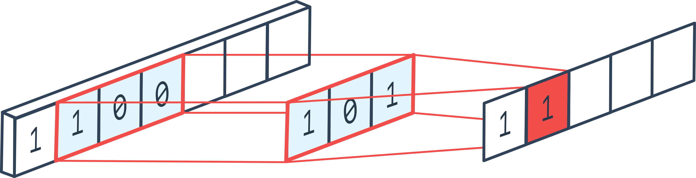

# Natural Language Processing

Here I describe how to create models to solve **text classification** problem. What layers should we use for this sort of problem, what is [projector.tensorflow.org](https://projector.tensorflow.org) and how to use it. What is `encoder`, `decoder` and so on!

## Text processing

In Machine Learning, there are many (_except of Transformers_) methods using what we can process text, here is a list of the the most used technics and layers that we can use:

- Text vectorization using `TextVectorizer` layer in Keras.
- Embedding: _Word-embedding_, _character embedding_, _sentence embedding_.
- Recurrent Neural Networks: using **RNN** we can make our model remember some aspects while learning. **RNN** are not used very widely due to vanishing and exploding gradient problems.

- Long-Short term memory: This machine in based on RNN and in widely used in text and speech recognition problem. **LSTM** machine is a complicated structure which consists of **LSTM** cells. Here is how **LSTM** cell looks from inside:

- Gated Recurrent Unit: This machine was introduced in 2014 as a machine which is very similar to the LSTM one. You should consider which machine is better for you based on your needs and experiments.

- Bidirectional layer: Bidirectional layer which cab be based on LSTM or GRU is a way to process input data bidirectionally. It means that we process input data two times:

  - First time we process it from left to right
  - Second time we process it from right to left

  Bidirectional layer can use either LSTM or GRU machine. It is important to say that this machine use two instances of either LSTM or GRU model under the hood. First machine is used to process data in _forward direction_ and second one is used to process data in _backward direction_.

- 1D Convolution: This layer can be used for text processing. This layer works the same way as a `Conv2D`. This layer also has filters and kernel size. `padding` parameter as well as other parameters which are used for convolutional layers can be used for this layer.

- Transfer Learning: _to be continued..._

## Text vectorization

There are several types of vectorization techniques commonly used in NLP, including:

- **Bag-of-Words (BoW)**: BoW is a simple and widely used technique for vectorizing text data. It represents each document as a vector of word counts, where each element of the vector corresponds to a particular word in the vocabulary. This technique ignores the order and structure of the words in the document, but can be effective in many NLP tasks, such as text classification and sentiment analysis.

- **TF-IDF**: Term Frequency-Inverse Document Frequency (TF-IDF) is a variation of BoW that assigns weights to each word in a document based on how often it appears in the document and how common it is across all documents. This technique can help to reduce the importance of common words like "the" and "and" while highlighting more meaningful words.

- **Word embeddings**: Word embeddings are dense, low-dimensional representations of words that capture their meaning and semantic relationships. They are typically learned from large amounts of text data using neural network models like Word2Vec, GloVe, and FastText. Word embeddings are often used as input to deep learning models for NLP tasks such as language modeling, text classification, and machine translation.

- **Character embeddings**: Character embeddings represent words or subwords as sequences of character embeddings, rather than as single tokens. This can be useful for handling out-of-vocabulary words, as well as for modeling morphological variations and spelling variations in text.

- **Sentence embeddings**: Sentence embeddings represent entire sentences as fixed-length vectors that capture their meaning and context. They can be generated using pre-trained models like the Universal Sentence Encoder or InferSent, or learned from scratch using neural network models like the SkipThought model.
