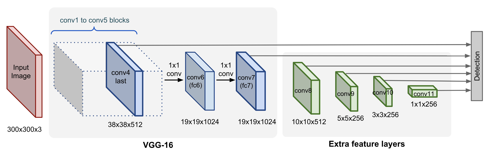

# Object Detection using Deep Learning Neural Networks

- `Region Proposal Network`
- `ROI Pooling` (Region of Interest Pooling)

- "One Stage" category: `SSD` (Single Shot multibox detector), `YOLO` (You only look once)
- "Two Stage" category: `RCNN`, `Faster RCNN`

## Faster RNN model

## SSD. Single Shot multibox detector model

SSD uses `Non-maximum suppression` operation. This operation uses `Intersection of a Union`, what is `Intersection` / `Union`
If `IoU` gives us number `> 0.5` than we delete one `RoI` with less confidence.

## YOLO. You only look once

YOLOv4 consist of:

- Backbone: CSPDDarknet53
- Neck: SPP, PAN
- Head: YOLOv3

## Choosing the right neural network for your object detection task

Things to consider:

1. Which is more important for you? Speed or accuracy?
2. How will you deploy your model? On the cloud? On the edge?

## Accuracy VS time

`mAP` - mean average precision

## LabelImg: Helpful tool to annotate images

LabelImg is a graphical image annotation tool.

It is written in Python and uses Qt for its graphical interface.

Annotations are saved as XML files in PASCAL VOC format, the format used by ImageNet. Besides, it also supports YOLO and CreateML formats.

On this [GitHub](https://github.com/heartexlabs/labelImg) you can find all about installation process of labelImg.
