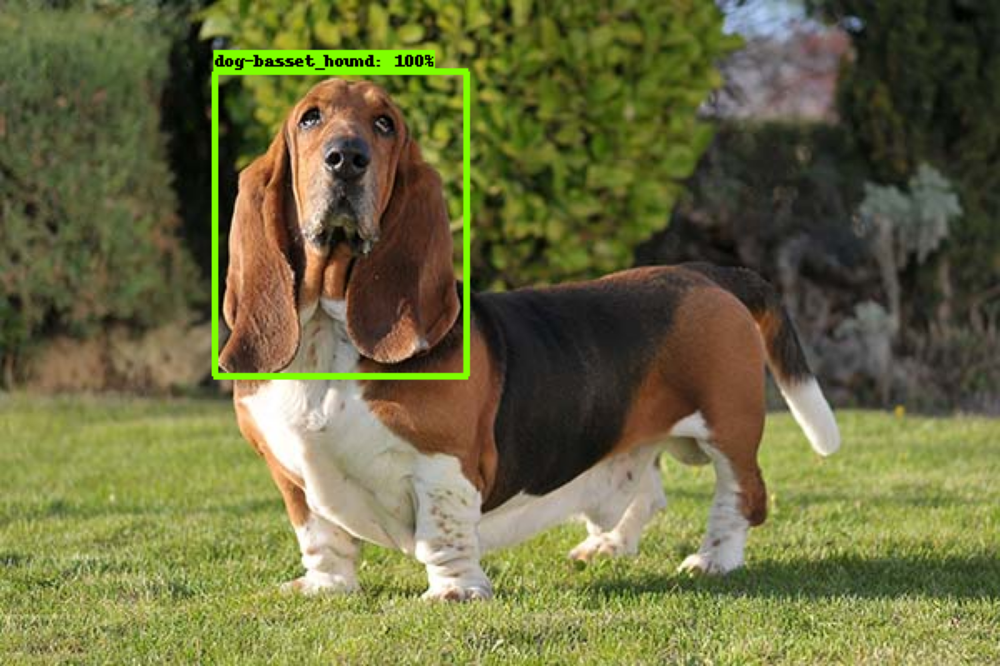

# Object Detection using Deep Learning Neural Networks

- `Region Proposal Network` - is a fully convolutional network that simultaneously predicts object bounds and objectness scores at each position.
- `ROI Pooling` (Region of Interest Pooling) - You can read what is ROI Pooling and why should we use it in [this article](https://erdem.pl/2020/02/understanding-region-of-interest-ro-i-pooling) because it is really hard to describe how this pooling works in several sentences.
- `RoIAlign` - Another awesome [article](https://erdem.pl/2020/02/understanding-region-of-interest-part-2-ro-i-align)!

- **"One Stage"** category: `SSD` (Single Shot multibox detector), `YOLO` (You only look once)
- **"Two Stage"** category: `RCNN`, `Faster RCNN`

## Faster RCNN model


## SSD. Single Shot multibox detector model


SSD uses `Non-maximum suppression` operation. This operation uses `Intersection of a Union`, what is `Intersection` / `Union`
If `IoU` gives us number `> 0.5` than we delete one `RoI` with less confidence.

## YOLO. You only look once


YOLOv4 consist of:

- Backbone: CSPDDarknet53
- Neck: SPP, PAN
- Head: YOLOv3

## Choosing the right neural network for your object detection task

Things to consider:

1. Which is more important for you? Speed or accuracy?
2. How will you deploy your model? On the cloud? On the edge?

## Accuracy VS time


## LabelImg: Helpful tool to annotate images

LabelImg is a graphical image annotation tool.

It is written in Python and uses Qt for its graphical interface.

Annotations are saved as XML files in PASCAL VOC format, the format used by ImageNet. Besides, it also supports YOLO and CreateML formats.

On this [GitHub](https://github.com/heartexlabs/labelImg) you can find all about installation process of labelImg.

## Training and evaluating process using TensorFlow Object Detection API

Here are command examples which you can use in order to train your own Object Detection model with Tensorflow:

```bash
# Train
PIPELINE_CONFIG_PATH=path_to_pipeline_file # enter here path to your .config file
MODEL_DIR=path_where_to_save_model

python object_detection/model_main_tf2.py \
--pipeline_config_path=${PIPELINE_CONFIG_PATH} \
--model_dir=${MODEL_DIR} \
--alsologtostderr # also output logs to std
```

Here `PIPELINE_CONFIG_PATH` is a path to `.config` file where we store our settings for our model. On the [following page](https://github.com/tensorflow/models/blob/master/research/object_detection/g3doc/tf2_detection_zoo.md) you can choose `Transfer Learning` model which you want to train on your own data. And [here](https://github.com/tensorflow/models/tree/master/research/object_detection/configs/tf2) you can find desired examples of config for the model you have chosen before.

Here is an example of bash script which you can use to evaluate your model:

```bash
# Evaluate
PIPELINE_CONFIG_PATH=path_to_pipeline_file # enter here path to your .config file
MODEL_DIR=path_from_where_load_model
CHECKPOINT_DIR=${MODEL_DIR} # file where your checkpoint file is stored, usually it is the same directory where your model output its results

python object_detection/model_main_tf2.py \
--pipeline_config_path=${PIPELINE_CONFIG_PATH} \
--model_dir=${MODEL_DIR} \
--checkpoint_dir=${CHECKPOINT_DIR} \
--alsologtostderr
```

After evaluation process has created additional files in `MODEL_DIR` directory you can look at the assessment using `TensorBoard`:

```bash
tensorboard --logdir=${MODEL_DIR}
```

Then you need to follow instructions from the console. (Usually you just need to open `localhost:port` in your browser, you can find `port` in the given instructions)

## Checkpoints

I created `checkpoints` folder where you can find already well-trained weights which you can load via code that you can find in `scripts/model_loader.py` script. Wish you luck!

## Freeze model

In order to use your model in production you have to convert your checkpoint into a normal TensorFlow model. To do that there is a special script laying in TensorFlow API folder. The path is `tensorflow/models/research/object_detection/exporter_main_v2.py`. Here is an example how this script works:

```bash
python exporter_main_v2.py --input_type="image_tensor" \
--pipeline_config_path=$PATH_TO_CONFIG \
--trained_checkpoint_dir=$MODEL_DIR\
--output_directory=$OUTPUT_DIR
```

### Short description for checkpoints

- `checkpoints/maskWearing_checkpoint.index` solves [maskWearing](https://public.roboflow.com/object-detection/mask-wearing) binary classification problem
- `checkpoints/petsBreed_checkpoint.index` solves [petsBreed](https://public.roboflow.com/object-detection/oxford-pets/1) multiclass classification problem.

## Examples

Here are some results from model which I have trained:



