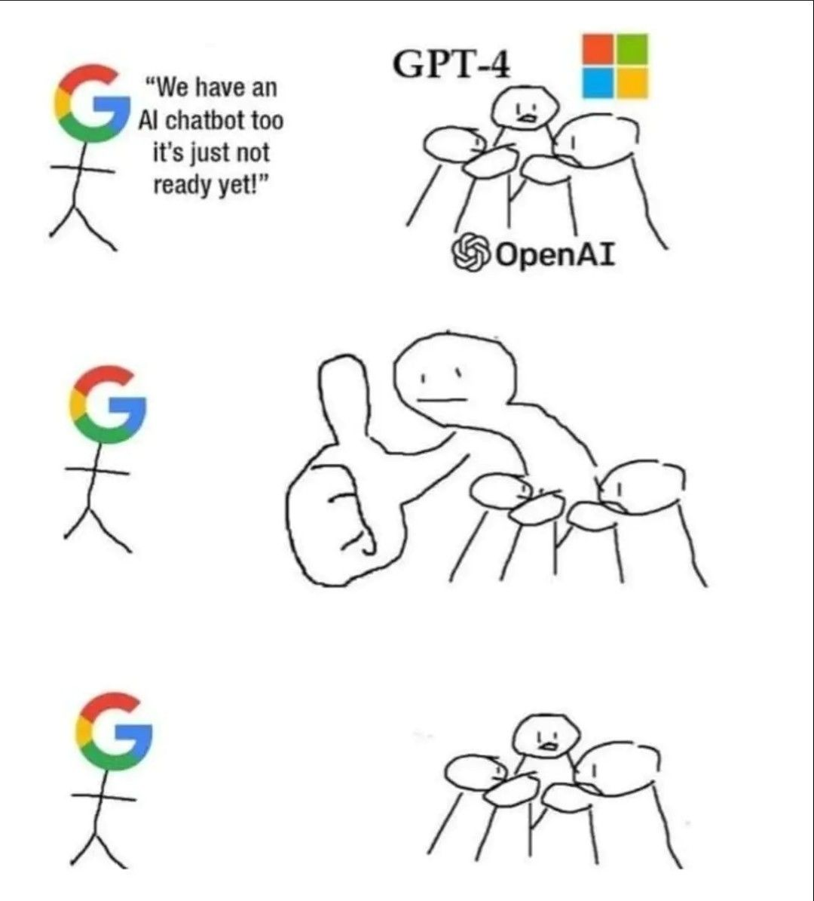

# Artificial Intelligence

Hello! My name is **Mark** and I study **Artificial Intelligence**, **Neural Networks** and **Machine Learning** algorithms! I found this sphere very interesting for myself and I already have posted on this GitHub repo a lot of things which you can learn about **Neural Networks** and **Artificial Intelligence**.

Me on Social Media:

[ Linked in](https://www.linkedin.com/in/markminerov/)

[ GitHub](https://github.com/MarkMinerov)

[ GitLab](https://gitlab.com/MarkMinerov)

