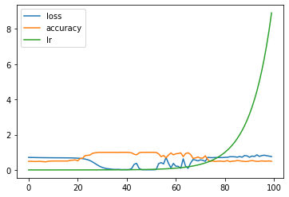
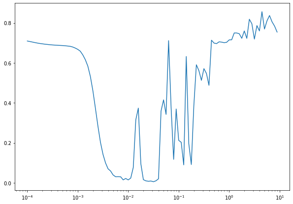

# Classification summary

- **clothes.h5** model was created to classify different clothes class. We can import this dataset the following way:

```python
from tensorflow.keras.datasets import fashion_mnist
```

- **number.h5** model was created to classify different numbers from 0 to 9. I reached **97%** of accuracy for this model. For now it is more than enough.

```python
(x_train, y_train), (x_test, y_test) = tf.keras.datasets.mnist.load_data()
```

To build a classification model we need to use **activation functions** and **Flatten** layers.

Example of model built for binary classification:

```python
model = tf.keras.Sequential([
    tf.keras.layers.Dense(100, activation="relu"),
    tf.keras.layers.Dense(10, activation="relu"),
    tf.keras.layers.Dense(1, activation="sigmoid"),
])
```

It is believed that we use reLU activation function on all layers except for the last one. For last we use either **sigmoid** _(for binary)_ or **softmax** _(for multi-class)_ activators.

We can also find the most appropriate learning rate using `LearningRateScheduler`. Here is an example:

```python
model.compile(loss=tf.keras.losses.BinaryCrossentropy(), optimizer=tf.keras.optimizers.Adam(learning_rate=0.01), metrics=["accuracy"])

lr_scheduler = tf.keras.callbacks.LearningRateScheduler(lambda epoch: 1e-4 * 10 ** (epoch / 20))

history = model.fit(X_train, y_train, epochs=100, callbacks=[lr_scheduler])

pd.DataFrame(history.history).plot()
```



```python
lrs = 1e-4 * (10 ** (tf.range(100) / 20))
plt.figure(figsize=(10, 7))
plt.semilogx(lrs, history.history["loss"])
```



Then we need to choose rate a little before it gets destructed.
For example, the most appropriate learning rate for this model is `0.008`

## Loss function

Use this `CategoricalCrossentropy` loss function when there are two or more label classes. We expect labels to be provided in a one_hot representation. If you want to provide labels as integers, please use `SparseCategoricalCrossentropy` loss. There should be `n classes` floating point values per feature.
